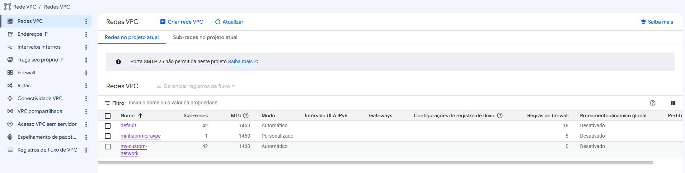
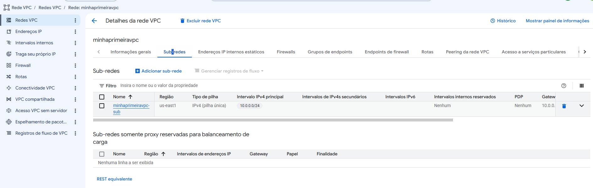
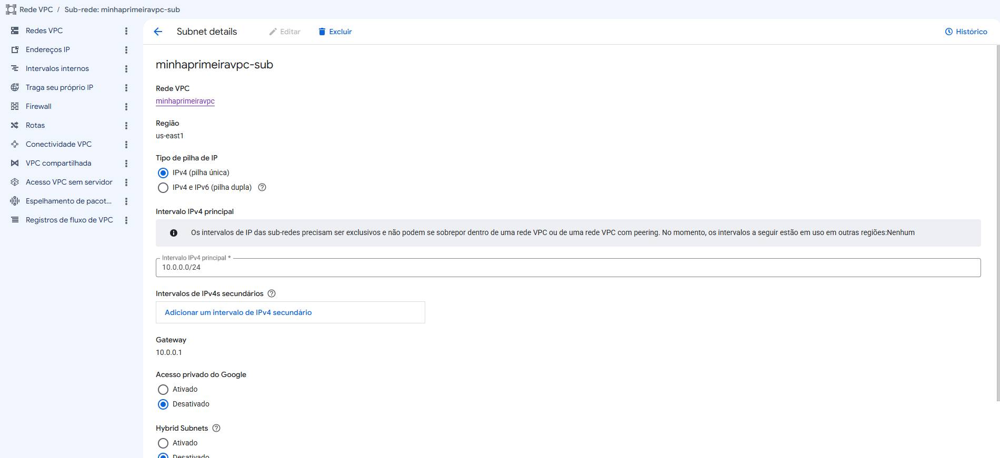
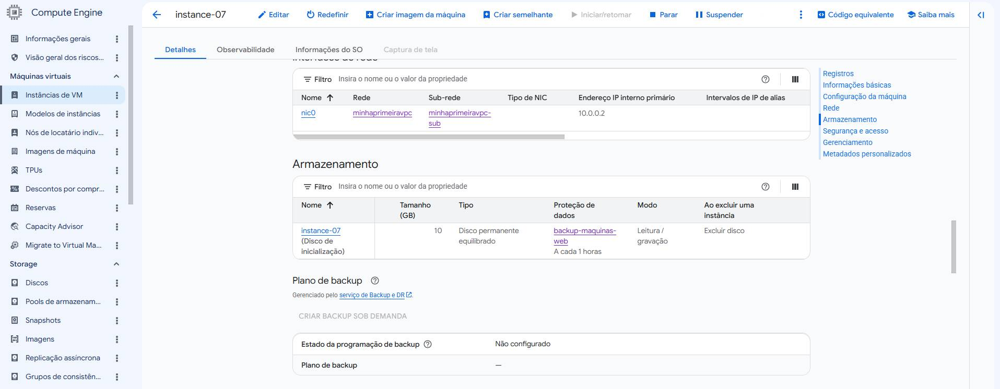
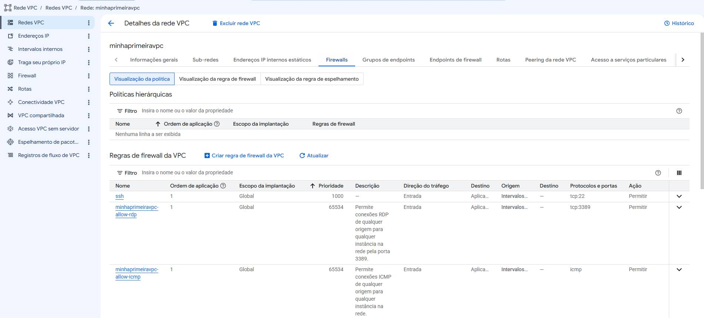
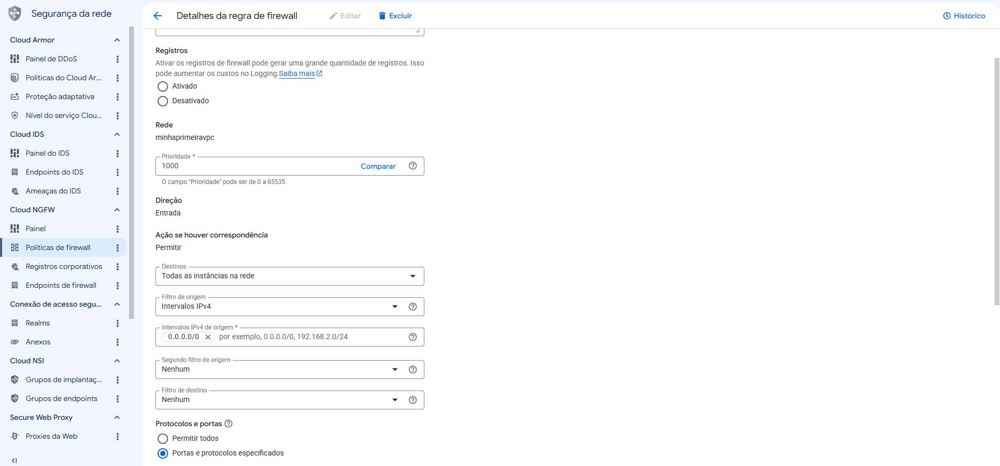

# Infraestrutura de Rede no Google Cloud Platform (GCP)

Este repositório documenta a criação de uma rede VPC (Virtual Private Cloud) no Google Cloud, incluindo sub-rede, instância de VM e políticas de firewall. As imagens anexadas ilustram cada etapa da configuração, servindo como guia para entender a topologia de rede básica no GCP.

---

## Visão Geral

A infraestrutura consiste em:

- **VPC**: `minhaprimeiravpc` (modo personalizado)
- **Sub-rede**: `minhaprimeiravpc-sub` na região `us-east1`
- **Instância VM**: com IP interno `10.0.0.2` na sub-rede acima
- **Regras de Firewall**: permitindo SSH (tcp:22), RDP (tcp:3389) e ICMP

---

## 1. Rede VPC

A VPC `minhaprimeiravpc` foi criada com as seguintes características:

- **Modo**: Personalizado (permite controle total sobre sub-redes e intervalos IP)
- **MTU**: 1460 (padrão)
- **Roteamento dinâmico global**: Desativado
- **Regras de firewall**: 5 regras associadas (incluindo as listadas abaixo)

---

## 2. Sub-rede

A sub-rede `minhaprimeiravpc-sub` está configurada da seguinte forma:

- **Região**: `us-east1`
- **Tipo de pilha IP**: IPv4 (pilha única)
- **Intervalo IPv4 principal**: `10.0.0.0/24`
- **Gateway**: `10.0.0.1`
- **Acesso privado do Google**: Desativado (pode ser ativado para permitir que VMs acessem serviços Google sem IP externo)
- **Sem intervalos IPv4 secundários** e **sem intervalos IPv6**

---

## 3. Instância de VM

Uma instância de VM foi criada dentro da sub-rede `minhaprimeiravpc-sub`. Os detalhes da interface de rede:

- **Nome da VPC**: `minhaPrimeiraVpc`
- **Nome da sub-rede**: `minhaPrimeiraVpc-sub`
- **Endereço IP interno primário**: `10.0.0.2`
- **Tipo de NIC**: padrão (assume-se VirtIO)
- **Intervalos de IP de alias**: Nenhum definido

---

## 4. Regras de Firewall

As regras de firewall são aplicadas à VPC `minhaprimeiravpc` e controlam o tráfego de entrada (ingress). As regras listadas são:

| Nome                              | Prioridade | Direção | Ação   | Protocolos/Portas | Origem          | Destino               |
|-----------------------------------|------------|---------|--------|-------------------|-----------------|-----------------------|
| `ssh`                             | 1000       | Entrada | Permitir| tcp:22            | 0.0.0.0/0       | Todas as instâncias   |
| `minhaprimeiravpc-allow-rdp`      | 65534      | Entrada | Permitir| tcp:3389          | 0.0.0.0/0       | Todas as instâncias   |
| `minhaprimeiravpc-allow-icmp`     | 65534      | Entrada | Permitir| icmp              | 0.0.0.0/0       | Todas as instâncias   |

### Detalhe da regra `ssh`

- **Prioridade**: 1000 (quanto menor, maior prioridade)
- **Direção**: Entrada (ingress)
- **Ação**: Permitir
- **Destinos**: Todas as instâncias na rede
- **Filtro de origem**: Intervalos IPv4 (`0.0.0.0/0`)
- **Protocolos e portas**: `tcp:22`

---

## Considerações Finais

- A VPC está no modo personalizado, permitindo expansão com novas sub-redes em outras regiões.
- As regras de firewall atuais são permissivas para acesso SSH, RDP e ICMP a partir de qualquer origem (`0.0.0.0/0`). Para ambientes de produção, recomenda-se restringir as origens a IPs específicos.
- A sub-rede utiliza apenas IPv4, mas pode ser atualizada para pilha dupla (IPv4/IPv6) se necessário.
- O acesso privado ao Google está desativado; caso as VMs precisem acessar APIs do Google sem sair da rede, deve ser ativado.

---